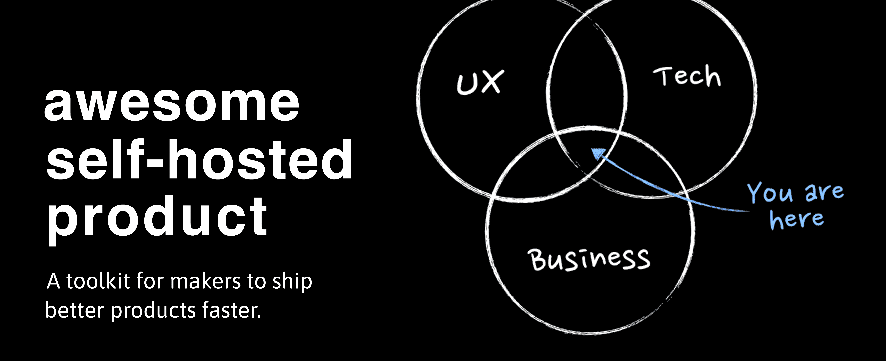

# awesome-selfhosted-product

Self-hosting is the practice of hosting and managing applications on your own server(s) instead of consuming from [SaaS](https://www.gnu.org/philosophy/who-does-that-server-really-serve.html) providers.

This is a list of [Free](https://en.wikipedia.org/wiki/Free_software) Software [network services](https://en.wikipedia.org/wiki/Network_service) and [web applications](https://en.wikipedia.org/wiki/Web_application) which can be hosted on your own server(s). The list is inspired by [Awesome Self-hosted](https://github.com/awesome-selfhosted/awesome-selfhosted), with a focus on app for product people.

The Awesome Self-hosted Product is a toolkit for makers to ship better products faster 🚀.

--------------------

## Table of contents

- [Analytics Tools](#analytics-tools)
  - [Product Analytics](#product-analytics)
  - [Web Traffic Analytics](#web-traffic-analytics)
- [Collaboration and Communication](#collaboration-and-communication)
  - [Community Discussion](#community-discussion)
  - [Community QA Platforms](#community-qa-platforms)
  - [Real-time Teamwork Platforms](#real-time-teamwork-platforms)
- [Developer Tools](#developer-tools)
  - [API Development](#api-development)
  - [App Performance Monitoring](#app-performance-monitoring)
  - [Big Data](#big-data)
  - [Billing](#billing)
  - [Pluggable Components](#pluggable-components)
  - [Software Development Kits (SDK)](#software-development-kits)
  - [Uptime Monitoring](#uptime-monitoring)
- [Idea Management Software](#idea-management-software)
  - [Document Management (DMS)](#document-management)
  - [Notetaking](#notetaking)
  - [Second Brain Tools](#second-brain-tools)
- [Marketing Tools](#marketing-tools)
  - [Email Automation](#email-automation)
  - [Social Media Automation](#social-media-automation)
- [Project Management](#project-management)
  - [Kanban Boards](#kanban-boards)
  - [Task and Ticketing Systems](#task-and-ticketing-systems)
- [Rapid Development Tools (Low Code/No Code)](#rapid-development-tools)
  - [Backend Database UI Tools](#backend-database-ui-tools)
  - [Web App Builders](#web-app-builders)
  - [Workflow Automation](#workflow-automation)
- [Sales and Business Tools](#sales-and-business-tools)
  - [Business Intelligence](#business-intelligence)
  - [Customer Relationship Management (CRM)](#customer-relationship-management-crm)
- [Web Dev Tools](#web-dev-tools)
  - [Blog Builders](#blog-builders)
  - [Content Management Systems (CMS)](#content-management-systems)
  - [E-commerce Platforms](#e-commerce-platforms)
  - [Image Optimization](#image-optimization)

--------------------

## Analytics Tools

### Product Analytics
*Mixpanel, LaunchDarkly, and HotJar Alternatives*

- [Countly Community Edition](https://count.ly) - Privacy-centric product analytics solution providing insights into how your users interact with your digital products, from acquisition to advocacy. ([Source Code](https://github.com/Countly/countly-server)) `AGPL-3.0` `Docker/Nodejs`
- [highlight](https://www.highlight.io/) - A full-stack monitoring platform. Error monitoring, session replay, logging and more. ([Source Code](https://github.com/highlight/highlight)) `Apache-2.0` `TypeScript`
- [OpenReplay](https://openreplay.com/) - A session replay suite, that lets you see what users do on your web app, helping you troubleshoot issues faster. ([Source Code](https://github.com/openreplay/openreplay)) `MIT` `Python`
- [PostHog](https://posthog.com) - Product analytics, session recording, feature flagging and a/b testing. ([Source Code](https://github.com/posthog/posthog)) `MIT` `Docker/Python`
- [rrweb](https://www.rrweb.io/) - A web session replay library, which provides easy-to-use APIs to record user's interactions and replay it remotely. ([Source Code](https://github.com/rrweb-io/rrweb)) `MIT` `TypeScript`

### Web Traffic Analytics
*Google Analytics Alternatives*

- [Ackee](https://ackee.electerious.com) - Node.js based analytics tool for those who care about privacy. Analyzes the traffic of your websites and provides useful statistics in a minimal interface. ([Demo](http://demo.ackee.electerious.com), [Source Code](https://github.com/electerious/Ackee)) `MIT` `Nodejs/Docker/K8S`
- [Aptabase](https://aptabase.com/) - An easy to use alternative to Google Firebase Analytics for Mobile and Desktop applications. ([Source Code](https://github.com/aptabase/aptabase)) `AGPL-3.0` `Docker`
- [Fathom Lite](https://github.com/usefathom/fathom) - A Google Analytics alternative that doesn’t compromise visitor privacy for data. Revolutionized website analytics by making them easy to use and respectful of privacy laws (like GDPR and more). `MIT` `Go/Docker`
- [GoatCounter](https://www.goatcounter.com) - Easy web analytics. No tracking of personal data. ([Source Code](https://github.com/arp242/goatcounter)) `EUPL-1.2` `Go`
- [Matomo](https://matomo.org/) - Take back control with Matomo – a powerful web analytics platform that gives you 100% data ownership. ([Source Code](https://github.com/matomo-org/matomo)) `GPL-3.0` `PHP`
- [Often](https://www.offen.dev/) - Let your users access their data end-to-end encrypted. Gain valuable insights at the same time. ([Source Code](https://github.com/offen/offen))
- [Plausible Analytics](https://plausible.io/) - An intuitive, lightweight web analytics. No cookies and fully compliant with GDPR, CCPA and PECR. ([Source Code](https://github.com/plausible/analytics/)) `MIT` `Elixir`
- [PoeticMetric](https://www.poeticmetric.com) - Privacy-first, regulation compliant Google Analytics alternative. ([Demo](https://www.poeticmetric.com/s?d=www.poeticmetric.com), [Source Code](https://github.com/th0th/poeticmetric)) `AGPL-3.0` `Docker`
- [Shynet](https://github.com/milesmcc/shynet) - A no cookies web analytics tool for personal projects and small to medium size websites. `Apache-2.0` `Python/Docker`
- [Umami](https://umami.is/) - Makes it easy to collect, analyze, and understand your web data — while maintaining visitor privacy and data ownership. ([Demo](https://app.umami.is/share/8rmHaheU/umami.is), [Source Code](https://github.com/umami-software/umami)) `MIT` `Nodejs/Docker`

## Collaboration and Communication

### Community Discussion

- [Bonfile](https://bonfirenetworks.org/) - Tend to your digital life in community. Customise and host your own online space and control your experience at the most granular level. ([Source Code](https://github.com/bonfire-networks/bonfire-app)) `AGPL-3.0` `Elixir`
- [Discourse](https://www.discourse.org/) - A community platform to those who want complete control over how and where their site is run. ([Source Code](https://github.com/discourse/discourse)) `GPL-2.0` `Ruby`
- [Flarum](https://flarum.org) - Delightfully simple forums. Flarum is the next-generation forum software that makes online discussion fun again. ([Source Code](https://github.com/flarum/flarum)) `MIT` `PHP`
- [Forem](https://www.forem.com/) -  Software for building communities for peers, customers, fanbases, families, friends, and more. ([Source Code](https://github.com/forem/forem)) `MIT` `Docker`
- [Mastodon](https://joinmastodon.org/) - A community platform to those who want complete control over how and where their site is run. ([Source Code](https://github.com/mastodon/mastodon)) `AGPL-3.0` `Ruby`

### Community QA Platforms
*Stack Overflow Alternatives*

- [Answer](https://answer.dev/) - An knowledge-based community software. Use it to quickly build your Q&A community for product technical support, customer support, user communication, and more. ([Source Code](https://github.com/answerdev/answer)) `Apache-2.0` `Docker/Go`
- [Talkyard](https://www.talkyard.io/) - Create a community, where your users can suggest ideas and get questions answered. And have friendly open-ended discussions and chat. ([Demo](https://www.talkyard.io/forum/latest), [Source Code](https://github.com/debiki/talkyard)) `AGPL-3.0` `Docker/Scala`

### Real-time Teamwork Platforms
*Slack and Microsoft Teams Alternatives*

- [Element](https://element.io/) - A glossy Matrix collaboration client for the web. ([Source Code](https://github.com/vector-im/element-web)) `Apache-2.0` `TypeScript`
- [Twake](https://twake.app/) - Twake is a secure collaboration platform to improve organizational productivity. ([Source Code](https://github.com/linagora/Twake)) `MIT` `Docker`

## Developer Tools

### App Performance Monitoring

- [Uptrace](https://uptrace.dev/) - An OpenTelemetry-based observability platform that helps you monitor, understand, and optimize complex distributed systems. Have confidence in your production and deliver better code faster than ever before. ([Source Code](https://github.com/uptrace/uptrace)) `Business Source License 1.1` `Go`

### API Development
*Postman Alternatives*

- [Hoppscotch](https://github.com/hoppscotch/hoppscotch) - A lightweight, web-based API development suite. Built with ease of use and accessibility in mind providing all the functionality needed for API developers with minimalist, unobtrusive UI. ([Demo](https://hoppscotch.io/ )) `MIT` `Docker`

### Big Data

- [Cube](https://cube.dev/) - The Semantic Layer for Building Data Applications. [Source Code](https://github.com/cube-js/cube)) `MIT` `Nodejs/Docker/K8S`

### Billing

- [lago](https://www.getlago.com/) - Scalable and modular architecture for metering and usage-based billing, at every stage of your company. [Source Code](https://github.com/getlago/lago)) `AGPL-3.0` `Shell`

### Software Development Kits

- [Apprise](https://hub.docker.com/r/caronc/apprise) - Push Notifications that work with just about every platform! ([Source Code](https://github.com/caronc/apprise)) `MIT` `Python/Docker`
- [pycaret](www.pycaret.org) - An open-source, low-code machine learning library in Python. ([Source Code](https://github.com/pycaret/pycaret)) `MIT` `Docker`

### Uptime Monitoring
*Uptime Robot Alternatives*

- [HertzBeat](https://hertzbeat.dromara.org/) - A real-time monitoring system with custom-monitoring, high performance cluster and agentless. Support monitoring web, database, os, middleware, cloudnative, network and more. [Source Code](https://github.com/dromara/hertzbeat)) `Apache-2.0` `Java`
- [Uptime Kuma](https://uptime.kuma.pet/) - A fancy self-hosted monitoring tool. ([Demo](https://demo.uptime.kuma.pet:27000/) [Source Code](https://github.com/louislam/uptime-kuma)) `MIT` `Nodejs/Docker`
- [Upptime](https://66uptime.com/) - A fancy self-hosted monitoring tool. [Source Code](https://github.com/upptime/upptime)) `MIT`

## Idea Management Software

### Document Management
*Paperwork and Docspell Alternatives*

- [Teedy](https://teedy.io/) - A lightweight document management system packed with all the features you can expect from big expensive solutions (Ex SismicsDocs). ([Demo](https://demo.teedy.io/), [Source Code](https://github.com/sismics/docs)) `GPL-2.0` `Docker/Java`

### Notetaking
*Notion and Evernote Alternatives*

- [Notesnook](https://notesnook.com/) - End-to-end encrypted. Write notes with privacy, no spying, no tracking. ([Source Code](https://github.com/streetwriters/notesnook)) `GNU-3.0` `React`

### Second Brain Tools
*Obsidian, Roam Research, Reflect Alternatives*

- [Quivr](https://www.quivr.app/) - Your second brain in the cloud, designed to easily store and retrieve unstructured information. ([Source Code](https://github.com/StanGirard/quivr)) `GNU-3.0` `Docker`

## Marketing Tools

### Email Automation
*Mailchimp & ActiveCampaign Alternatives*

- [Listmonk](https://listmonk.app/) - High performance, self-hosted newsletter and mailing list manager with a modern dashboard. ([Source Code](https://github.com/knadh/listmonk)) `AGPL-3.0` `Go/Docker`

### Social Media Automation
*Buffer & Hootsuite Alternatives*

- [Mixpost](https://mixpost.app/) - Easily create, schedule, publish, and manage social media content in one place, with no limits or monthly subscription fees. ([Source Code](https://github.com/inovector/MixpostApp)) `MIT` `PHP/Docker`
- [Socioboard](https://github.com/socioboard/Socioboard-5.0) - A powerful social media management and content marketing platform. Using this software users can streamline their social media operations and content marketing.  `GPL-3.0` `Nodejs`

### Interactive Presentations
*Slido, AhaSlides, Mentimeter Alternatives*

- [Claper](https://claper.co/) - Turn your presentations into an interactive, engaging and exciting experience. It's time for your presentations to become more than just a series of slides. ([Source Code](https://github.com/ClaperCo/Claper)) `GPL-3.0` `Elixir/Docker`

### Link Shortener
*TinyURL & Bitly Alternatives*

- [Kutt](https://kutt.it) - A modern URL shortener with support for custom domains. ([Source Code](https://github.com/thedevs-network/kutt)) `MIT` `Nodejs`
- [YOURLS](https://yourls.org/) - No strings attached. Full control over your data, on your own domain. ([Source Code](https://github.com/YOURLS/YOURLS)) `MIT` `PHP/Docker`

## Project Management

### Task and Ticketing Systems
*Jira, ClickUp, and Linear Alternatives*

- [Focalboard](https://www.focalboard.com/) - Define, organize, track and manage work across individuals and teams. ([Source Code](https://github.com/mattermost/focalboard), [Clients](https://www.focalboard.com/download/personal-edition/desktop/)) `MIT/AGPL-3.0/Apache-2.0` `Nodejs/Go`
- [Leantime](https://leantime.io) - A strategic project management system for non-project managers. ([Source Code](https://github.com/leantime/leantime)) `GPL-2.0` `PHP`

### Kanban Boards
*Trello & Alternatives*

- [Kanboard](https://kanboard.org/) - Simple and visual task board. ([Source Code](https://github.com/kanboard/kanboard)) `MIT` `PHP`
- [Lavagna](https://lavagna.io) - An issue/project management tool designed for small teams. Lightweight, pure Java, easy to install, easy to use. ([Source Code](https://github.com/digitalfondue/lavagna)) `GPL-3.0` `Java`
- [Planka](https://planka.app/) - The realtime kanban board for workgroups built with React and Redux. ([Demo](https://plankanban.github.io/planka/#/), [Source Code](https://github.com/plankanban/planka)) `AGPL-3.0` `Nodejs`
- [Restyaboard](https://github.com/RestyaPlatform/board) - Trello like kanban board. Based on Restya platform. `OSL-3` `Docker/Golang`
- [Taiga](https://www.taiga.io/) - Agile Project Management Tool based on the Kanban and Scrum methods. ([Source Code](https://github.com/kaleidos-ventures)) `MPL-2.0` `Docker/Python/Nodejs`
- [TaskCafe](https://github.com/JordanKnott/taskcafe) - A project management tool with Kanban boards. `MIT` `Docker/Golang`
- [Wekan](https://wekan.github.io/) - Open-source Trello-like kanban. ([Source Code](https://github.com/wekan/wekan)) `MIT` `Nodejs`

## Rapid Development Tools
*Low Code/No Code*

### Backend Database UI Tools
*Airtable Alternatives*

- [Apache Superset](https://superset.apache.org/) - Data exploration and visualization platform.
- [APITable](https://github.com/apitable/apitable) - API-oriented low-code platform.
- [Appwrite](https://appwrite.io) - End to end backend server for web, native, and mobile developers 🚀. ([Source Code](https://github.com/appwrite/appwrite)) `BSD-3-Clause` `PHP`
- [Baserow](https://baserow.io/) - Create your own no-code database alternative to Airtable. ([Source Code](https://gitlab.com/bramw/baserow)) `MIT` `Docker`
- [basetool](https://www.basetool.io/) - Internal tool framework.
- [Bytebase](https://www.bytebase.com/) - Safe database schema change and version control for DevOps teams, supports MySQL, PostgreSQL, TiDB, ClickHouse, and Snowflake. ([Demo](https://demo.bytebase.com), [Source Code](https://github.com/bytebase/bytebase)) `MIT` `Docker/K8S/Go`
- [Chartbrew](https://chartbrew.com) - Web application that can connect directly to databases and APIs and use the data to create beautiful charts. ([Demo](https://app.chartbrew.com/live-demo), [Source Code](https://github.com/chartbrew/chartbrew)) `MIT` `Nodejs/Docker`
- [Directus](https://directus.io/) - An Instant App & API for your SQL Database. Directus wraps your new or existing SQL database with a realtime GraphQL+REST API for developers, and an intuitive admin app for non-technical users. ([Source Code](https://github.com/directus/directus)) `GPL-3.0` `Nodejs`
- [Grist](https://getgrist.com/) - Grist is a next-generation spreadsheet with relational structure, formula-based access control, and a portable, self-contained format (alternative to Airtable). ([Demo](https://docs.getgrist.com), [Source Code](https://github.com/gristlabs/grist-core)) `Apache-2.0` `Nodejs/Python`
- [Motor Admin](https://www.getmotoradmin.com/) - No-code admin panel and business intelligence software - search, create, update, and delete data entries, create custom actions, and build reports. ([Source Code](https://github.com/motor-admin/motor-admin)) `AGPL-3.0` `Ruby`
- [NocoDB](https://www.nocodb.com/) - No-code platform that turns any database into a smart spreadsheet. ([Source Code](https://github.com/nocodb/nocodb)) `GPL-3.0` `Nodejs/Docker`
- [PocketBase](https://pocketbase.io/) - Backend for your next SaaS and Mobile app in 1 file. ([Source Code](https://github.com/pocketbase/pocketbase)) `MIT` `Go/Docker`
- [Redash](http://redash.io) - Connect and query your data sources, build dashboards to visualize data and share them with your company. ([Source Code](https://github.com/getredash/redash)) `BSD-2-Clause` `Docker`
- [rowy](https://www.rowy.io/) - Manage your database on a spreadsheet-UI.
- [ToolJet](https://tooljet.io/) - Low-code framework to build & deploy internal tools with minimal engineering effort. ([Source Code](https://github.com/ToolJet/ToolJet)) `GPL-3.0` `Nodejs`
- [Totum](https://chartbrew.com) - Business database for non-programmers. Universal UI, simple-code logic, automatic actions, access rules, logging, API and more. Quickly create a complex internal apps using the database as an interface. ([Demo](https://app.chartbrew.com/live-demo), [Source Code](https://github.com/totumonline/totum-mit)) `MIT` `PHP`

### Web App Builders
*Webflow, Retool and Softr Alternatives*

- [Budibase](https://www.budibase.com) - Build and automate internal tools, admin panels, dashboards, CRUD apps, and more, in minutes (alternative to Outsystems, Retool, Mendix, Appian). ([Source Code](https://github.com/Budibase/budibase)) `GPL-3.0` `Nodejs`
- [Convertigo](https://www.convertigo.com/) - Enterprise grade Low Code / No Code platform.
- [NocoBase](https://www.nocobase.com/) - NocoBase is a scalability-first, open-source no-code/low-code platform.
- [OpenBlocks](https://github.com/openblocks-dev/openblocks) - Retool Alternative.
- [Saltcorn](https://github.com/saltcorn/saltcorn) - Free and no-code application builder.

### Workflow Automation
*Make, IFTTT, Zapier Alternatives*

- [Activepieces](https://www.activepieces.com) - No-code business automation tool like Zapier or Tray. For example, you can send a Slack notification for each new Trello card. ([Source Code](https://github.com/activepieces/activepieces)) `MIT` `Typescript`
- [airbyte](https://github.com/rudderlabs/airbyte) - Open-source platform for data replication.
- [Automatisch](https://automatisch.io) - Business automation tool that lets you connect different services like Twitter, Slack, and more to automate your business processes (alternative to Zapier). ([Source Code](https://github.com/automatisch/automatisch)) `AGPL-3.0` `Docker`
- [beehive](https://github.com/muesli/beehive) - A flexible event/agent & automation system.
- [flogo](https://www.flogo.io/) - Ecosystem for serverless functions and apps.
- [Huginn](https://github.com/huginn/huginn) - Allows you to build agents that monitor and act on your behalf. `MIT` `Ruby`
- [MindsDB](https://mindsdb.com/) - MindsDB is an AI layer for existing databases that allows you to effortlessly develop, train and deploy state-of-the-art machine learning models using standard queries. ([Source Code](https://github.com/mindsdb/mindsdb)) `GPL-3.0` `Docker/Python`
- [n8n](https://n8n.io/) - Free and source-available workflow automation tool.
- [Outerbridge](https://www.outerbridge.io/) - Automations for on-chain and off-chain applications. ([Source Code](https://github.com/Outerbridgeio/Outerbridge)) `Apache-2.0` `TypeScript`
- [StackStorm](https://stackstorm.com) - StackStorm (aka _IFTTT for Ops_) is event-driven automation for auto-remediation, security responses, troubleshooting, deployments, and more. Includes rules engine, workflow, 160 integration packs with 6000+ actions and ChatOps. ([Source Code](https://github.com/StackStorm/st2)) `Apache-2.0` `Python`
- [Syndesis](https://syndesis.io/) - Integration capabilities as a service.

## Sales and Business Tools

### Business Intelligence

- [Metabase](https://metabase.com/) - Easy, open-source way for everyone in your company to ask questions and learn from data. ([Source Code](https://github.com/metabase/metabase)) `AGPL-3.0` `Java/Docker`
- [Technical Writing on HubSpot]([https://metabase.com/](https://github.com/crate-workbench/hubspot-tech-writing)) - Support writing technical documentation on HubSpot.

### Customer Relationship Management (CRM)
*Hubspot and Salesforce Alternatives*

- [Erxes](https://erxes.io/install/) - Marketing, sales, and customer service platform designed to help businesses attract more engaged customers. ([Source Code](https://github.com/erxes/erxes)) `GPL-3.0` `Docker`
- [odoo](https://www.odoo.com/) - The only platform you will ever need to help run your business: integrated apps, kept simple, and loved by millions of happy users. ([Source Code](https://github.com/odoo/odoo)) `GPL-3.0` `Docker`

## Web Dev Tools

### Blog Builders
*Medium Alternatives*

- [btw](https://www.btw.so/) - Set up your personal blog in minutes.

### Content Management Systems
*Wordpress and Wix Alternatives*

- [Cromwell CMS](https://cromwellcms.com/) - Cromwell CMS is a next-gen e-commerce and blogging platform that unites bleeding-edge web techs in an extraordinary user-friendly format.
- [Payload CMS](https://payloadcms.com/) - Developer-first headless CMS and application framework. ([Demo](https://demo.payloadcms.com), [Source Code](https://github.com/payloadcms/payload)) `MIT` `Nodejs`
- [Tina](https://tina.io/) - Tina is a fully open-source headless CMS that supports Git.
- [Wagtail](https://wagtail.io/) - Django content management system focused on flexibility and user experience. ([Source Code](https://github.com/wagtail/wagtail)) `BSD-3-Clause` `Python`

### E-commerce Platforms
*WooCommerce, Squarespace, and Shopify Alternatives*

- [Bagisto](https://bagisto.com/en/) - Leading Laravel e-commerce framework with multi-inventory sources, taxation, localization, dropshipping and more exciting features. ([Demo](https://demo.bagisto.com/), [Source Code](https://github.com/bagisto/bagisto)) `MIT` `PHP`
- [Evershop](https://evershop.io/) - NodeJS E-commerce Platform.

### Image Optimization

- [imgproxy](https://imgproxy.net/) - Fast and secure standalone server for resizing and converting remote images. ([Source Code](https://github.com/imgproxy/imgproxy)) `MIT` `Docker`

### Pluggable Components

- [react-trello](https://github.com/rcdexta/react-trello) - Pluggable component to add a kanban board to your application.
- [Privoce](https://privoce.com/) - Pluggable components to provides a chat widget (in the browser), bot components to you as SDKs, and all modules can run on your personal cloud server.
